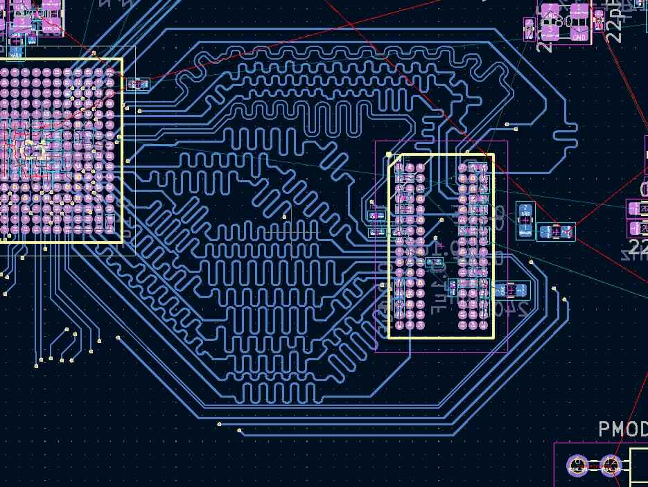
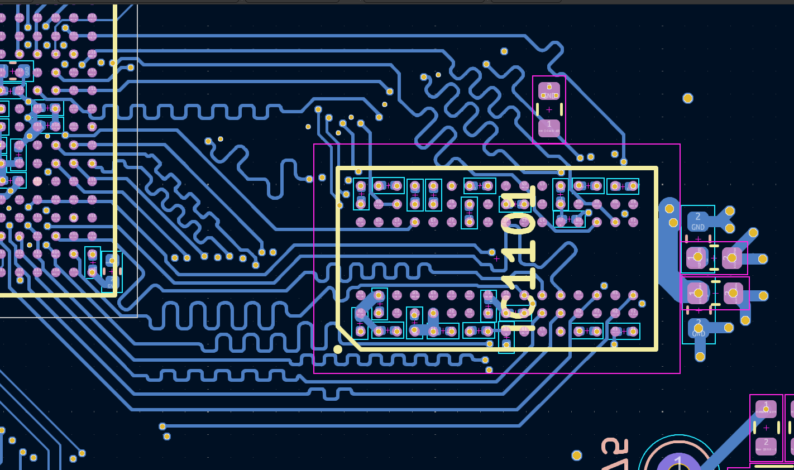
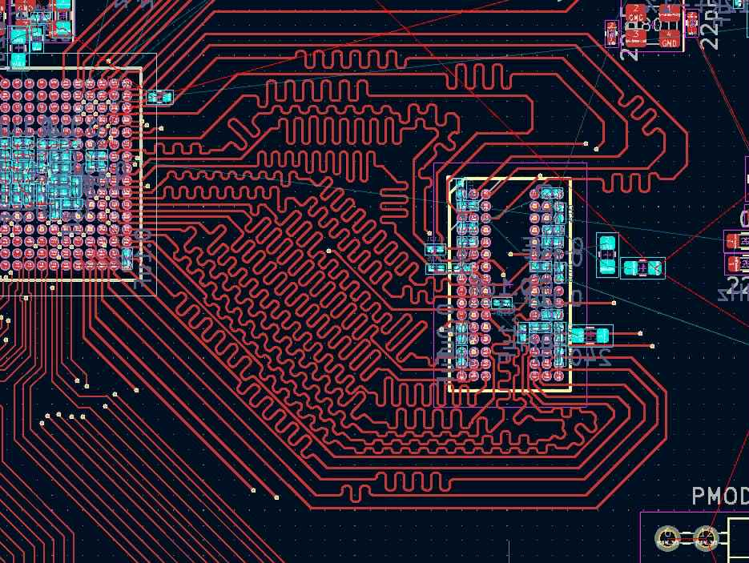
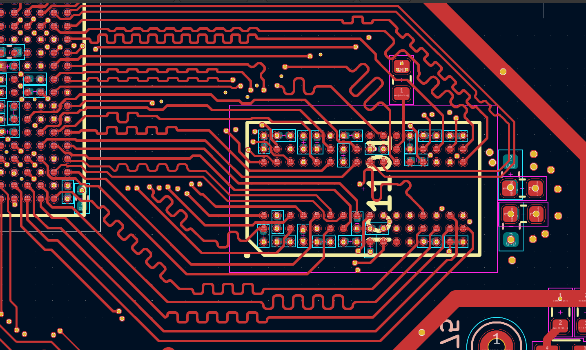
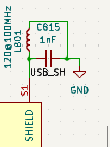

# acoustic-processing-hw
Repository for the main FPGA-processing board of my acoustic characterization device.

## Design goal
The goal of the board is to 
1. Measure analog signals amplified by a [pre-amplifier board](https://github.com/igorwolfs/acoustic-preamp-hw) for signals picked up from the piezo, at frequencies between 0.1 and 10 MHz. These analog signals are stored in RAM after measurement, processed on the FPGA and passed on.
2. Drive PWM signals for a [single-phase inverter-board](https://github.com/igorwolfs/acoustic-piezodriver-hw) connected to a piezo-element.

## Design constraints
Apart from technical constraints such as sampling rate (> 20 MHz), transfer / processing speed (10-bit x 35 MHz), etc... The main design constraint was keeping the price as low as possible.

## Stackup / Routing
6-layer stackup (JLC06161H-3313) with 
- L1, L6: controlled impedance layers.
	- 50 Ohm non-coplanar microstrip: 
		- TL Width (W): 0.157 mm 
		- Spacing between conductors: 2-3 x W
	- 100 Ohm differential non-coplanar
		- TL width (W): 0.122 mm
		- Diff-pair spacing: 0.2032 mm
		- Conductor spacing: 2-3 x W
- L4: power plane:
	- +2V5 Auxiliary FPGA voltage
	- +1V35 LPDDR3 voltage
	- +1V2 ETH voltage
	- +3V3 digital
	- +3V3 analog
- L2, L3, L5: GND planes
	- L2 (L1 reference)
	- L3 (L4 reference)
	- L5 (L6 reference)

### Rationale
Main reason for choosing a 6-layer over an 8-layer stack-up was price. Keeping LPDDR3-traces at appropriate impedance and matching delays proved to be a challenge with this layer count. Outcome to be judged after bringup.

## Main IC's
- Lattice EC5U-FPGA, with 25k LUT's.
- LPDDR3-RAM
- USB 33200-PHY (ULPI-bus)
- Ethernet PHY (RGMII interface)
- Analog frontend with MS9280 ADC in diff-mode, (fs <=35 MHz).

### Routing / Selection Rationale
#### Lattice ECP5U
The Lattice ECP5U was the best price-quality in terms of computing power. 

With a max CLK frequency of about 400 MHz it can operate around the lowest DDR3 speed class.

#### Micron-DDR3 PHY
Anticipated was that around lower DDR3-speed classes (300 MHz, $\lambda = \frac{c}{300e6 * \sqrt{4.1}} = 50 cm$), delay-matching becomes less of an issue and higher ECP5U rise and fall times increase tolerance margin for the 50 ohm single-ended / 100 ohm differential impedance requirements.

- CMD-CTRL-bus 
	- signals led through vias twice.
	- CK+/- 42 mm
	- CMD/CTRL BUS signals kept around 35 mm (between 34-37 mm)
- DQU-group 
	- led through vias twice.
	- UDQS+/-: 21.7 mm
	- Data-signals kept within 1.5 mm
- DQL-group
	- signals kept on the first layer only.
	- LDQS+/-: 19.85 mm
	- Data-signals kept within 1.5 mm

 > References: [Orangecrab Board](https://github.com/orangecrab-fpga/orangecrab-hardware]), Section 3.18 Lattice FPGA-DS-02012-3.2, [Micron DDR3 SDRAM](https://jlcpcb.com/api/file/downloadByFileSystemAccessId/8588894245961019392) table 58

#### USB3300-EZK
- ULPI-bus operating at 60 MHz
	- Traces were delay-matched.
	- Impedance matched to 50 ohms.
- 2 Schmitt triggers were added for read-out of CC-line voltage to determine current USB PD capacity.

#### MS9280 ADC
Sampling rate > 2 times Nyquist, purchasing price was less than 1 $.

#### ADC RJ45 connectors + switch

2 RJ45 connectors meant to transfer analog signals attached with a switch. A comparison will be made for measuring analog signals between
- An RJ45 connector with internal magnetics.
- An RJ45 connector without magnetics, and with external blocking capacitors.
	- Capacitors might need to be changed, to stay out of S.R.F territory and limit phase-shift between differential signals.

#### W25Q128JVS SPI
2 external 128 MBit SPI IC's connected
- One to flash the ECP5U bitstream.
- One to flash firmware used in case of a soft-core CPU configured in the FPGA-fabric.

#### Other
More info on routing can be found in the (rather chaotic) [layout folder](docs/layout/) and [component selection folder](docs/schematic/component_selection/).

Simulations for ADI-devices can be found inside [ltspice-folder](simulations/ltspice/), TI-related sims can be found in the [TI-folder](simulations/TINA/)

## Booting
### Loading Bitstream 
2 possible ways of loading the bitstream of the ECP5U
- The JTAG-PMOD connector
- Flashing the external 128 MBit SPI connected to the startup MSPI of the ECP5U.

## Reviews
### Reddit
The first iteration of the design was placed on [reddit for review](https://www.reddit.com/r/PrintedCircuitBoard/comments/1m0hude/schematic_review_request_ecp5ufpga_board_with_hs/).

The initial design included longer trace-lengths to the DDR-PHY to achieve better delay and impedance matching. It was deemed that for the given stackup, sacrificing delay-budget and inter-trace distance wasn't worth the increase in trace lengths at those frequencies.

<table>
  <tr>
    <th>Before</th>
    <th>After</th>
  <tr>
    <td> </td>
    <td></td>
   </tr> 
   <tr>
      <td></td>
      <td>
  </td>
</tr>
</table>

### Other
An additional LC-filter was added between shield and ground mostly for ESD-reasons.

