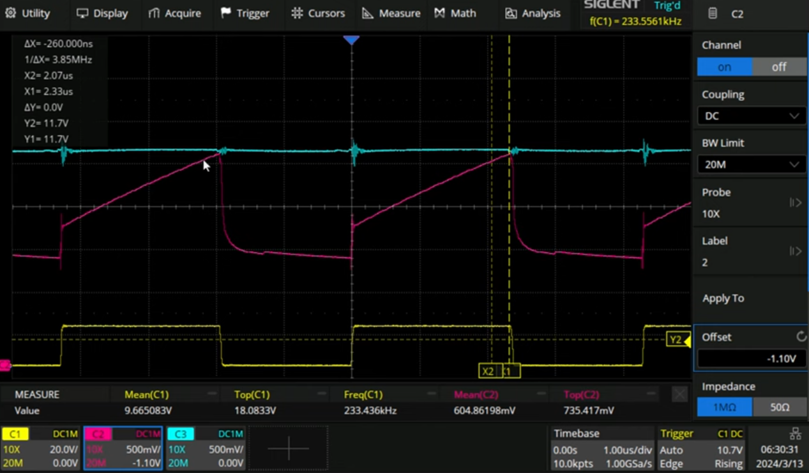
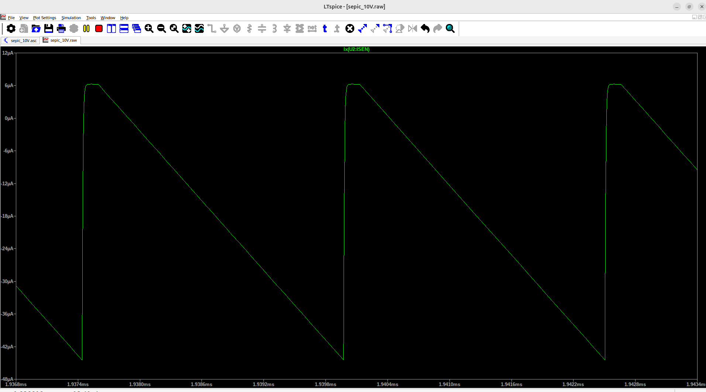
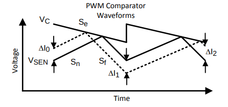

# Theory
## control
### Solution 1: Standard voltage controller
- No matter how much current you draw from the source, the output voltage stays the same.
- A measure of the output voltage is taken, and passed to a "compensator"
	- IN-: Output signal measure
	- IN+: Reference
- Comparator
	- IN-: fixed ramp
	- IN+: error measure

#### Issue 1:
- Load regulation is good
- Line regulation is bad
	- If the input changes, the control loop responds badly

The input voltage signal goes through a massive time constant due to the combined capacitor + inductor.
- Standard voltage-mode controller works badly

Therefor 2 alternative controllers weren designed: voltage with ff, current mode

### Stability
If the diode is located BEFORE the inductor, there is no RHP-zero
- Voltage mode is then an option. (buck, full-bridge, half-bridge, ..)

If your diode is located after the inductor
- You do have a RHP-Zero: you NEED to use current mode control. (boost, )

## Voltage mode with voltage feedforward
Get a measure of the voltage changes and forward it to the error reference.
Do this by making the ramp proportional to the input voltage.

## Peak Current Mode Control

Take a measure of the input and feed it to the control algorithm.

Feed the peak of the inductor current instead of the voltage.
- Usually taken right after the switch
- Add a set-reset flip-flop

Global order of events:

Every [1 / (200 kHz)] pulse connected to the set-pin:

1. Reference is hit the flip-flop.
2. Flip-flop turns on the switch.
3. Current starts going up.
4. As soon as the inductor current peak hits the reference, flip-flop is reset and the switch turns off.

So basically we are controlling the peak of the inductor current.

### Stability - Subharmonic oscillations

#### When does it happen
- Happens around 50 % duty cycle (in reality a bit earlier)

#### How does it look
- Thick and thin pulses are alternating

#### Reason

Happens due to the way we generate PWM in peak-current control:
- We turn the switch off when the peak inductor current hits the demand value.
- We turn the switch on at fixed time intervals (e.g.: 400 kHz).

**At duty cycle < 50 %:**
- Subharmonic oscillations STILL OCCUR, they, however, naturally decay.

**At duty cycle > 50 %:**
- Perturbations of the current don't decay in the control circuit.
- Slope compensation here changes your ramp so it is only partially generated by current, and has partial voltage mode control.
	- This however has an effect of the control level (you're introducing a bit of voltage-mode control)

### Application
- Current sensing is difficult, invasive, etc..
Use in case of
- Multiple power stages (current sharing)
- Push-pull converters
- Discontinuous mode operation
	- Voltage mode response deteriates completely.

## Sources
- https://www.youtube.com/watch?v=CPvx9K6eTHo&ab_channel=Biricha
- https://www.youtube.com/watch?v=PiEvBJSekGc&ab_channel=Biricha

# Requirements
- 15 amp peak currents
- 5 amp rms current
- up to 20 V input voltage
- up to 40 V output voltage

# LM3478
## Configuration
### SEPIC
Might be used to increase / reduce the voltage, however
- A capacitor is needed to carry the whole current and voltage
- You need 2 times the amount of inductors

However your load and source are decoupled.

### Boost converter
Boosts voltage.

### Synchronous buck-boost
- For this we'd need another IC since we need 2 switches. These IC's however tend to be pretty expensive. 

### Single-switch Buck-Boost
Inverts the supply voltage

## Current mode control
- ISEN-pin: Peak current is sensed through the MOSFET over the external resistor R4.
  - This forms a resistive divider with Rds_on and R4.
  - This voltage is fed into the +PWM_COMP of the PWM comparator
- FB-pin: Voltage fed back from the divider, fed into the  -ERR_AMP
- COMP: OUT_ERR_AMP
  - Added to the slope compensation ramp
  - Fed into -PWM_COMP

1. Device switching START:
  - Voltage > UVLO set point + FA/SD is pulled down
2. Switching cycle start
  - Oscillator sets RS-latch
  - DR pin is set too high -> MOSFET set high (peak current 1 amp)
3. At a certain point, +PWM_COMP > -PWM_COMP
  - RS latch will be reset
  - External Mosfet will turn off
4. Output capacitor C_out will discharge
  - V_out will reduce
  - Feedback voltage will be lower than the 1.25 V reference
  - Error amplifier will be positive
  - PWM_COMP_OUT will become more negative
  - RS latch will be set again by oscillator
5. Back to 2

## Overvoltage Protection
- FB: Additional input to +OVP_COMP
- Vfb + Vovp: input to -OVP_OMP
  - Vovp: 32-50 V
  - Vovp_hys is between 20 and 110 mV
- OV_COMP_OUT: Makes the FET output go low

So basically, if the feedback has an oscillation > 60 mV (ofn the 1.25 V reference), there will be a fet shutdown.

## Slope compensation ramp
- Normally CCM is inherently unstable at a duty cycle of 50 % or more.
  - In that case the inductor current diverges
  - So to reach a voltage of 40 volts we need a supply of at least 20 V

### Slope compensation
#### Slope without compensation

- The Isen pin outputs a constant current ramp.
- It forces the voltage across your Rsense to limit your inductor current
$$I_{Comparator} = G_{m, cs} * I_{L} * R_{Sense}$$

When adding a resistor to that ramp, you add an extra ramp current onto the summing node:
$$I_{Comparator} = G_{m, cs} * I_{L} * R_{Sense} + R_{sl} * 40 uA$$

#### Existing slope compensation
- Existing ramp 
  - Vs(t) (Inductor sense voltage across resistor)
  - Vsl(t)-ramp (generated by Rsl).
    - Internally equal to about 100 mV
When Vs(t) + Vsl(t) = Vcomp, the switch turns off.

#### Compensating
- For small Vsl(t): peak current control
- Large Vsl(t): comparator trips before Vs rises

Adding e.g.: 10 kOhm (with 40 uA / ohm)
- 40 uA * 10e3 = 400 mV

#### Solution

- Se: internally generated (V_SL =5 V, the internal ramp:) 
$$S_e = V_{SL} * f_{s}$$ 
- Sn: Ramp up when current runs through the switch (switch closed) 
$$S_N = \frac{V_{IN} * R_{sen}}{L}$$
- Sf: Ramp down when switch closed $$S_{f} = R_{sen} * \frac{V_{OUT} - V_{IN}}{L}$$

So the difference in inductor current becomes: 
$$\Delta I_n = \frac{S_{f} - S_{e}}{S_{n}+S_{e}}$$

Note that for a gain of 1 this equations diverges.
Adding a resistor Rsl in the Isen-path changes the S_{e} to:
$$S_{e} = (V_{SL} + (K*R_{SL}))*f_{s}$$

However: higher slope compensation leads to less influence from the sensed current.

## Frequency adjust / shutdown
- External resistor at FA/SD is adapted to change the switching characteristics
  - R = 25 kOhm -> 1 MHz switching frequency
  - R = 200 kOhm -> 100 kHz switching frequency

### Low vs High frequency
High frequency
- CON:
  - Higher inductor, dielectric, switching loss (Eddy currents + Hysteresis)
  - Your feedback loops bandwidth is higher, so more sensitive to parasitics and oscillations
- PRO:
  - smaller magnetics / caps

Reverse is true for lower frequencies

### Shutdown pin
When applied voltage is > 1.35 V
- LM3478 stops switching

## Short-circuit Protection
- Isen > 343 mV -> short circuit current limit protection happens. (in case the MOSFET shorts out)

## Switching voltage
- Below 7.2 V: Vin used to shift the low-side FET
- Above 7.2 V: Internal LDO creates reference voltage bias
