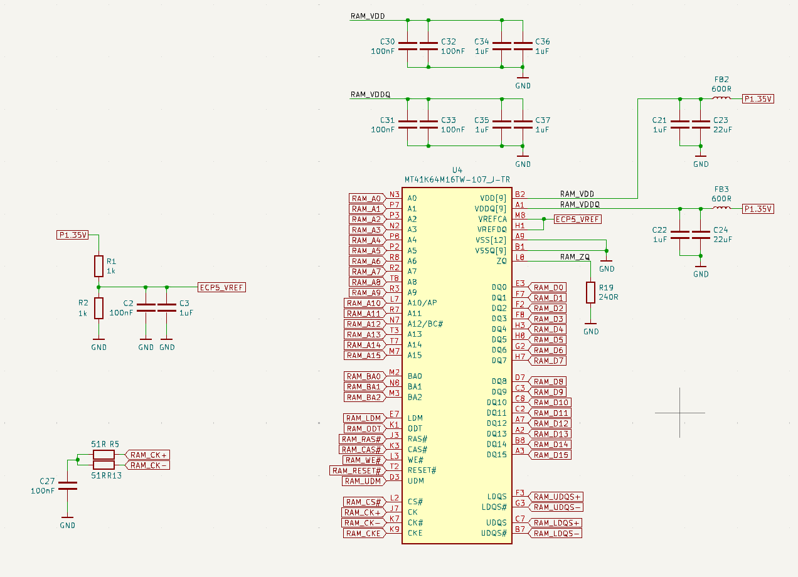
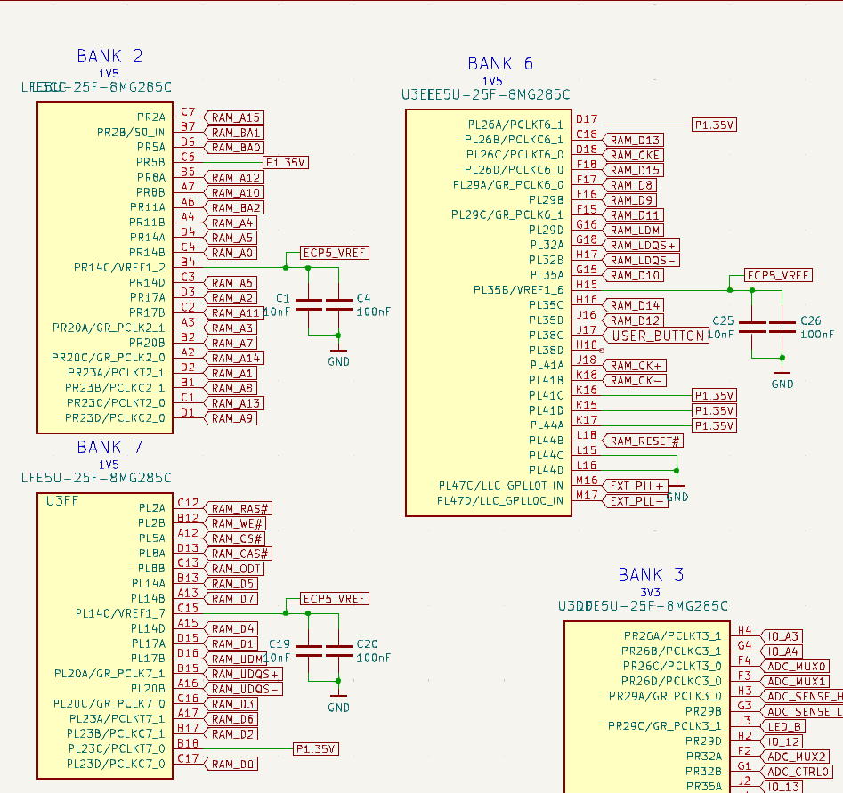
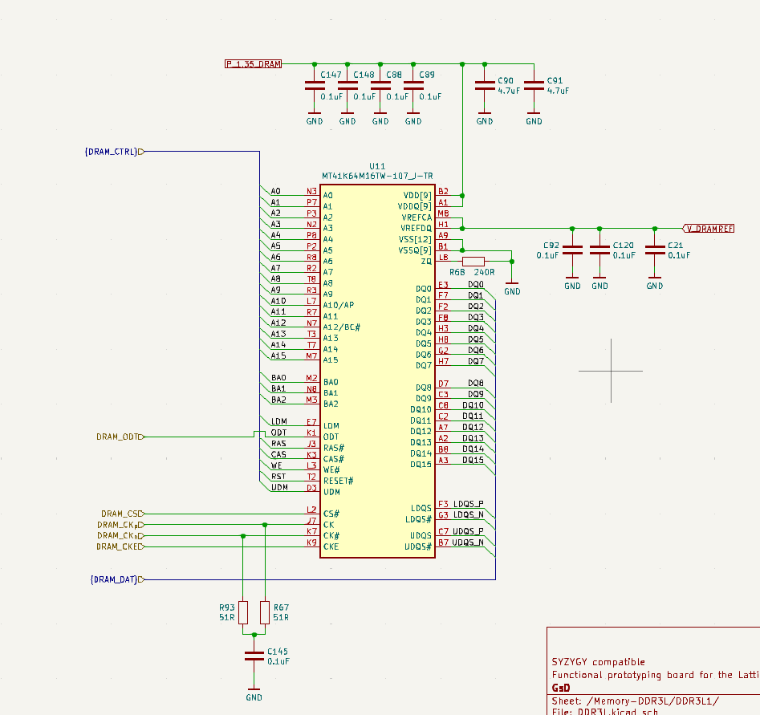
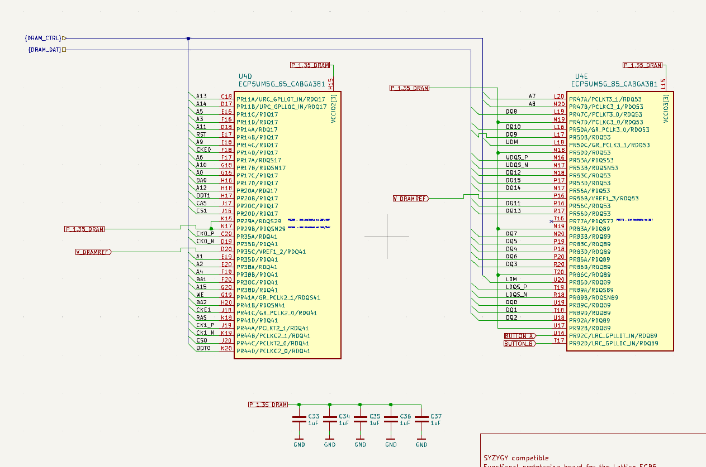

# DDR3
## Lattice Support
Lattice  supoprts DDR3/DDR2 and LPDDR2/LPDDR3 memory with DQS logic up to 800 Mb/s

### Lattice IP
More about it can be found here: https://www.latticesemi.com/products/designsoftwareandip/intellectualproperty/ipcore/ipcores02/ddr3phy

- LUT's used is 942-1066
- DDR Data-bus width can be up to 64-bits, we however go for 16 bits

### LiteDRAM
- https://boxlambda.readthedocs.io/en/latest/components_litedram/?utm_source=chatgpt.com
- https://github.com/enjoy-digital/litedram?utm_source=chatgpt.com

Opensource DRAM controller

## DDR3 vs DDR3L
DDR3L supports lower power voltage than the DDR3.
- Supply voltage of about 1.35 V instead of 1.5 V
- Used in orangecrab

Choose the MT41K256M16TW-107:P.

## DDR3L Ram Choice
It has about 512 MBytes of memory and is of the same company / family as the orange-crab RAM

## Pin selection
- Data and address signals must connect to RDQ pins (also called registered DQS-pins or read-data-queue pins) on the ECP5.
	- Contain high-speed deskewable input paths (calibrated by the FPGA's DDR controller on boot)

#### WARNING! Data has different timing than the address and settings for DDR3
DQ are driven on both rising and falling edges of DQS (and internal DDR-clock)

- Keep the pins together in their own DQS groups.
	- So the built-in delay and calibration logic can be implemented

Each DQS-group has 2 pre-placed pins for
- DQS and DQSn-signals
- Rest of the DQS pins can be used as DQ or DM signals
- DQS groups with more than  1pins, have up to 2 pre-defined pins to be used as VCCIO
	- This way soft connections are made to the output pins

If you connect the wrong DQS pins, you might get hundreds of picoseconds of delay between the raw I/O paths for output signals.

#### Lattice ECP5U-specific
Banks with DQS pins
- Bank 2, 3, 6 and 7 have 2 DQS groups each
- there are 2 LDQS pins per bank (LDQS, LDQSn)
	- DQS-buffer: 
		- applies a 90 degree shift on reads / 0 degree on writes
		- logic circuitry for preampble / postable detection
		- Necessary for HF sync.

### RDQ 
Read Data Queue pins. Registered DQ input paths used to capture incoming data from DRAM.

Contains a built-in adjustable delay

### LDQ
Launch data queue pins. Registered DQ output paths.
These are used when you write DRAM.

### Clock pins
Note these clock pins are only usefull to inject clocks with, they don't have any significant advantage when outputting clocks.
Any IO in the same region will normally have a < 50 ps skew with pins in the same region.

#### _GPLL[T/C]_IN pins
General-purpose PLL input pins
- Feed into the on-die PLL via low-skew routing.
- Used to drive a PLL from an external clock source
- Repurposable for general IO when unused

#### PCLK[T/C][Bank]_[num] pins
- Primary Clock inputs
	- Direct injection into the primary clock network
	- "T": true, "C": complement
- Used for input clocks you want fanned out across the chip.

#### GR_PCLK[Bank][num] pins
- General-routing primary-clock pads
- 2 per bank of these
- Clock pin that can be used in case all of the above are unused.

### VREF for bank
This pins doubles as an analog reference pin.
There needs to be 0.75 V reference fed to it (SSTL-15 standard), which provides a reference for the address / command pins.

- Must be fed externally (e.g.: resistive divider)
- Must contain reference caps

### Assigning spare IO's to power
Used for power.

https://github.com/orangecrab-fpga/orangecrab-hardware/issues/53

## Pin selection
### Data pins
- Lower 8 data-bits: need to be connected to one group (e.g.: group A).
- Upper 8 data-bits: need to be connected to another group (e.g.: group B).

### LDQS / LDQS#
Strobe for lower byte (DQ0-7) (group A)

### UDQS / UDQS#
Strobe for the upper byte (DQ8-15) (group B)

### Address / Command / Control pins
- Synchronized to a single CK / CK# pair
- Should be tied to the same BANK (same Vcc, same clock network)

### CK / CK#
- Should (preferably) use the same bank as the bank where the address and config pins.

# Examples

## OrangeCrab
RAM: MT41K64M16TW-107_J-TR
- https://mm.digikey.com/Volume0/opasdata/d220001/medias/docus/6538/557_MT41K64M16TW_Datasheet.pdf
- 8 MB DDR3-RAM

MT41K64M16 – 8 Meg x 16 x 8 banks

- So this is 8 x 16 Mbits per bank = 128 Mbits per bank.
- 8 banks
- So 128 MBytes of RAM

### Pins
#### Data pins
Connected to bank 6

#### Address pins / Reset / ECP vref / BA / CKE
Connected to bank 2

- 16 data-pins
- BA0..2 pins: 
	- Bank-address input, defines to which bank to apply ACTIVE, READ, WRITE or PRE-CHARGE
	- The DDR-ram has 8 internal bank, each one with 64 Meg x 16
- LDM
- ODT: on-die termination
	- HIGH: internal termination resistance to DDR enabled
	- LOW: internal termination resistance disabled
- RASn, CASn, WEn: command inputs
- RESETn
- UDM:
	- Data mask (basically write-enable)
- RAM_CSn: chip select
	- if CS is enabled (so pulled low) the command decoder is enabled
- RAM_CK+/-: differential clock inputs
- RAM_CKE: clock enable
	- When high: clock + additional circuitry enabled
	- When low: input buffers for CK+-, CKE, RESETn, ODT disabled
- UDQS+/-
	- Data strobe
- LDQS+/-
	- Termination data strobe
- ZQ: external reference for output drive calibration (should be tied to 240 ohm tied to DQ-ground)

### Clock speed
#### Speed grade
Take a look at the "speed grade".
- JEDEC spec table (AZ electrical characteristics)

RAM: MT41K64M16TW-107_J-TR
- Suffix: 107 so speed grade is -107
- MT/S: mega-transfers per second = half the DRAM clock frequency
- tCK: clock period

NOTE:
- Backward compatibility exists with 1066, 1333 and 1600.
- Clock-rate is HALF the data-rate
	- So MT/S of 1600 requires an 800 MHz toggling CK / CK# pair

However backward compatibility is normally standard for DDR3 controllers.

### Voltage supply
- RAM_VDD at 1.35 V
- RAM_VDDQ at 1.35 V
- ECP5_VREF at 1.35 V

DQ supply vs regular supply
- DQ is 

## ButterStick

