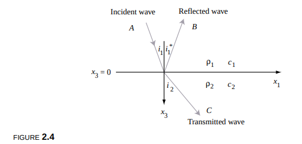

# Wave Equations
## Generic

### 1-dimensional generic solution
$u_{tt} = c^2*u_{xx}$

Solution for the 1D wave equation, with $u = \delta(x)$, Shows a wave forming in each direction.

- $\frac{1}{2} * \delta(x-c*t) + \frac{1}{2}*\delta(x+c*t)$ 

Solution for the 1D wave-equation, all initial conditions ($u(0, x)$, $\frac{\partial{u(0, x)}}{\partial{{t}}}$).

- $u(x, t) = \frac{1}{2} [u_0(x - ct) + u_0(x + ct)] + \frac{1}{2c} \int_{x - ct}^{x + ct} v_0(\xi) \, d\xi$

	- v0: the initial condition for the wave velocity at time 0.
	- u0: the initial condition for the wave displacement at time 0.

## Elastic Waves
Propagation of mechanical waves in solids.

Infinitesimal change in displacement field $\delta u_i$. 
- u(x, t): displacement of a particle at position x at time t.
- x: 3d-vector showing actual position (not displacement, as u(x, t) does)

After taylor series expansion and rewriting as a vector identity:

$\delta u_i = \underbrace{e_{ij} \delta x_j}_{\text{stretch}} + \underbrace{\frac{1}{2} [(\nabla \times \mathbf{u}) \times \delta \mathbf{x}]_i}_{\text{rotation}} = (\overline{\overline{e}} \cdot \delta \mathbf{x})_i + \frac{1}{2} [(\nabla \times \mathbf{u}) \times \delta \mathbf{x}]_i \quad$
- $e_{ij} = \frac{1}{2} (\partial_j u_i + \partial_i u_j)$

- A stretch-part - Strain tensor
	- Describes how particles in a solid are stretched due to a displacement field.
	- Introduces stresses in the solid
- A rotation-part - stress tensor
	- Describes stresses in the solid introduced by the displacement field
	- Multiplying this tensor with the normal to a surface, will give you a vector indicating the x, y and z components of the force on the surface in that point.

$\mathbf{T} = \hat{\mathbf{n}} \cdot \overline{{\mathbf{T}}}\Delta S$

- Traction T: 
	- Represents the force vector on a point of a plane $\Delta S$.
	- By integrating the traction over the body area, we get the total force acting on the body.

Balancing the traction force with the external forces and interial forces:

$\rho \frac{\partial^2 \mathbf{u}}{\partial t^2} = \nabla \cdot {\overline{\mathbf{T}}} + \mathbf{f}$

This shows that the stress force is caused by strains in the solid.
Assume small perturbation so $\Tau$ is linarly dependent on $\overline e$.

$\Tau_{ij} = C_{ijkl} * \overline e_{kl}$
- This is called the **Constitutive Relation** for a solid.

In case of isotropy, $C_{ijkl}$ is independent of coordinate rotation, and can be written as:

$C_{ijkl} = \lambda \delta_{ij} \delta_{kl} + \mu (\delta_{jk} \delta_{il} + \delta_{il} \delta_{ik})$
- $\lambda, \mu$ are Lame constants.

Consequently, filling this into the the equation for $\Tau_{ij}$ and filling in $\Tau_{ij}$ into our equation of motion, we get **the elastic wave equation for homogenous and isotropic media**:

$$\rho \frac{\partial^2 \mathbf{u}}{\partial t^2} = (\lambda + \mu) \nabla (\nabla \cdot \mathbf{u}) + \mu \nabla^2 \mathbf{u}  + f$$

Rewriting the equation, and assuming the external force to be zero:

$$\rho \frac{\partial^2 \mathbf{u}}{\partial t^2} = (\lambda + 2\mu) \nabla (\nabla \cdot \mathbf{u}) - \mu \nabla \times (\nabla \times \mathbf{u})$$

The generalized wave equation can, depending on the initial deformation, lead to a variety of wavefronts
- Planar (Constant displacement perpendicular to propagation direction)
- Spherical (Radially outward / inwaard travelling waves from a point source)
- Cylindrical waves (Radially outward / inward travelling from a line-source)
- Surface waves (Rayleigh / Love): waves confined to the surface of a material

### Generic solution

#### Homogenous medium
Using separation of variables we get that a linear combination of $\phi(x, t)$ is a solution:

$$
\varphi(\mathbf{x}, t) = e^{i(k_1 x_1 + k_2 x_2 + k_3 x_3 - \omega t)} = e^{i(\mathbf{k} \cdot \mathbf{x} - \omega t)}
$$

## Acoustic Waves

- Assuming the shear modulus $\mu$ to be zero
	- Shear modulus G / $\mu$ measures resistance to shape deformations at constant volume.
	- Deformations of fluid don't make it "store" energy, it simply flows.
- Leaving only the bulk modulus $\lambda$	
	- Bulk modulus K / $\lambda$ measures resistance to uniform volumetric compression.
- Taking the divergence ($\nabla \cdot$)

We gets **the acoustic wave equation for homogenous media**:\
$\rho \frac{\partial^2 \theta}{\partial T^2} = \lambda \nabla^2 \theta + \nabla \cdot \mathbf{f}$

There are no shear waves which reduces the pressure field to: 
$$
\frac{1}{c^2} \frac{\partial^2 P}{\partial t^2} = \nabla^2 P, \quad \text{where } c = \sqrt{\frac{\lambda}{\rho}}
$$

#### Solutions at a planar interface

The incoming wave:
$$
P_{inc} = A e^{i\omega \left(\frac{\sin i_1}{c_1} x_1 + \frac{\cos i_1}{c_1} x_3 - t\right)} \quad (2.26)
$$
The reflected wave:
$$
P_{refl} = B e^{i\omega \left(\frac{\sin i_1^*}{c_1} x_1 - \frac{\cos i_1^*}{c_1} x_3 - t\right)} \quad (2.27)
$$
The transmitted wave:
$$
P_{trans} = C e^{i\omega \left(\frac{\sin i_2}{c_2} x_1 + \frac{\cos i_2}{c_2} x_3 - t\right)} \quad (2.28)
$$

Using boundary conditions
- Continuity of pressure at the boundary
- Constant vertical displacement along the boundary

#### Simplified solution: Snells law
Valid when the incident angle is equal to the angle of reflection, and the transmission angle is related to i.
$$
\frac{B}{A} = \frac{\frac{\cos i_1}{\rho_1 c_1} - \frac{\cos i_2}{\rho_2 c_2}}{\frac{\cos i_1}{\rho_1 c_1} + \frac{\cos i_2}{\rho_2 c_2}}
$$

$$
\frac{C}{A} = \frac{2 \frac{\cos i_1}{\rho_1 c_1}}{\frac{\cos i_1}{\rho_1 c_1} + \frac{\cos i_2}{\rho_2 c_2}} 
$$

We call $\rho * c$ the impedance of the fluid. $i$ is he incident angle of the wave.
- High impedance: large pressure leads to small particle velocity.
- Low impedance: small pressure leads to large particle velocity.

#### In case i1 is too large
Solution becomes an exponentially decaying wave:
$$
C e^{i\omega(px_1 - t)} e^{i\omega \sqrt{\frac{1}{c_2^2} - p^2} x_3} = C e^{-\omega \sqrt{p^2 - \frac{1}{c_2^2}} x_3} e^{i\omega(px_1 - t)}
$$

$$
\frac{\sin i_2}{c_2} = p
$$

### Plane waves on a free surface of an elastic half-space

Reflected P-wave:
$$
\frac{P'}{P} = \frac{-\left(\frac{1}{\beta^2} - 2p^2\right)^2 + 4p^2 \cos i_\alpha \cos j_\beta}{\left(\frac{1}{\beta^2} - 2p^2\right)^2 + 4p^2 \cos i_\alpha \cos j_\beta} \quad (2.40)
$$

Reflected SV-wave:
$$
\frac{P'}{S} = \frac{4 \frac{\alpha}{\beta} p \cos i_\alpha \left(\frac{1}{\beta^2} - 2p^2\right)}{\left(\frac{1}{\beta^2} - 2p^2\right)^2 + 4p^2 \cos i_\alpha \cos j_\beta} \quad (2.41)
$$

### Raleigh waves

Pair of evanescent waves: P-wave type and SV-wave type, added together can satisfy the free surface boundary condition when p takes a special value.

P and S-Waves propagating as spherical wavefronts through the interior decrease proportional to the distance travelled: $\frac{1}{r}$.

Rayleigh waves propagate in a circular wavefront over the earth's surface with attenuation $\frac{1}{\sqrt{r}}$.

## Transversal versus Longitudinal waves (Body waves)

They propagate through the interior of an elastic medium. Boundary conditions satisfy the bulk elastodynamic wave equation in 3D.

### P (Primary) / Longitudinal waves
- Fastest wave
- Particle motion is in the SAME direction as the propagation direction.

### S (Secondary) / Transverse waves
- Slowest wave
- Particle motion perpendicular to the propagation direction.

### Example
A displacment in the x-direction, will, in an isotropic medium with no Lame-moduli gradients lead to
- A longitudinal P-wave in the x-direction, with speed $c = \sqrt{\frac{\lambda + 2\mu}{\rho}}$
- A transverse S-wave in the y and z-direction, with speed $c = \sqrt{\frac{\mu}{\rho}}$

## Evanescent waves / Inhomogenous plane waves

Travel along a free surface / interface. Waves behave according to Rayleigh's characteristic equation for phase velocity and depth decay.

### Rayleigh waves
- Decay is exponential with depth beneath the surface
	- So discontinuity detection can be done up to 1.4
- Used for surface flaw detection

# Assumptions
## Isotropy
### Plastics
- 3D printed materials: often invalid (hexagonal anisotropy)
- Most polymer plastics are not really isotropic, because any production method which takes a plastic from a reactor to usable form creates orientation. (injecting, melting, cooling)
- You can assume however for heterogenous polymers that have enough time to cool down that they are quite anisitropic.

### Metal alloys
- Depends on the manufacturing properties.

## Independence of sheer / bulk modulus on frequency
In reality, when testing the material with TOF-sensors using piezo-electrics, the value obtained will not be a constant property independent of frequency.

## Bulk and shear modulus values
### Voight bound for modulus
Assumes each grain in the polycrystal experience the same macroscropic strain.

So the single-crystal stiffness constants are averaged,and an upper bound for the moduli is acquired.

#### Bulk modulus:
$$
B_V = \frac{1}{9} (C_{11} + C_{22} + C_{33} + 2(C_{12} + C_{13} + C_{23}))
$$

#### Shear modulus:
$$
G_V = \frac{1}{15} (C_{11} + C_{22} + C_{33} - (C_{12} + C_{13} + C_{23}) + 3(C_{44} + C_{55} + C_{66}))
$$

### Reuss bound for modulus

Assumes each grain carries the same macroscopic stress, which gives a lower boundary for the moduli.

#### Bulk modulus:
$$
B_R = (S_{11} + S_{22} + S_{33} + 2(S_{12} + S_{13} + S_{23}))^{-1}
$$

#### Shear modulus:
$$
G_R = \left(15 \left(4(S_{11} + S_{22} + S_{33}) - 4(S_{12} + S_{13} + S_{23}) + 3(S_{44} + S_{55} + S_{66})\right)\right)^{-1}
$$

### Voigt-Reuss-Hill average
Simply the arithmetic mean of Reuss and Voight bounds.

# Sources:
### Wave equations
- Solving the 1D wave equation on a string: https://www.youtube.com/watch?v=9TQCKWWAVjM&t=103s&ab_channel=MITOpenCourseWare
- d'alemberts solution to the 1D wave equation: https://personal.math.ubc.ca/~ward/teaching/m316/lecture21.pdf
- Elastic wave derivation: https://engineering.purdue.edu/wcchew/course/ElasticWaveNotes.pdf

### Transversal vs Longitudinal
- https://www.ldeo.columbia.edu/~richards/webpage_rev_Jan06/Ch2_ElasticWaves_in_Solids.pdf

### Ultrasonic testing
-  https://content.ndtsupply.com/media/Ultrasonic%20Testing-%20USAF-Tech-Manual-NR2.pdf?utm_source=chatgpt.com
