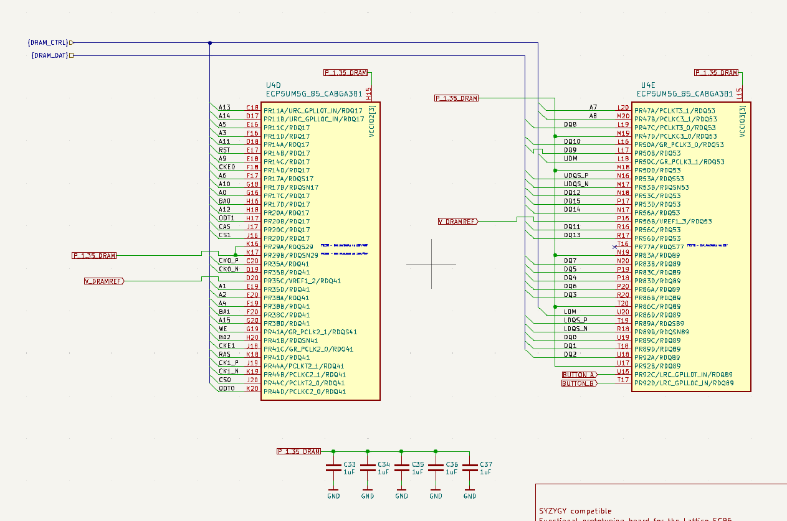

# DDR3
## Lattice Support
Lattice  supoprts DDR3/DDR2 and LPDDR2/LPDDR3 memory with DQS logic up to 800 Mb/s

### Lattice IP
More about it can be found here: https://www.latticesemi.com/products/designsoftwareandip/intellectualproperty/ipcore/ipcores02/ddr3phy

- LUT's used is 942-1066
- DDR Data-bus width can be up to 64-bits, we however go for 16 bits

### LiteDRAM
- https://boxlambda.readthedocs.io/en/latest/components_litedram/?utm_source=chatgpt.com
- https://github.com/enjoy-digital/litedram?utm_source=chatgpt.com

Opensource DRAM controller

## DDR3 vs DDR3L
DDR3L supports lower power voltage than the DDR3.
- Supply voltage of about 1.35 V instead of 1.5 V
- Used in orangecrab

Choose the MT41K256M16TW-107:P.

## DDR3L Ram Choice
It has about 512 MBytes of memory and is of the same company / family as the orange-crab RAM

## Pin selection

- Data and address signals must connect to RDQ pins (also called registered DQS-pins or read-data-queue pins) on the ECP5.
	- Contain high-speed deskewable input paths (calibrated by the FPGA's DDR controller on boot)

#### WARNING!
- Keep the pins together in their own DQS groups.
	- So the built-in delay and calibration logic can be implemented
- Use the RDQ / LDQ pins the MIG IP assigns for the chosen DQ width and bank.

Each DQS-group has 2 pre-placed pins for
- DQS and DQSn-signlas
- Rest of the DQS pins can be used as DQ or DM signals
- DQS groups with more than  1pins, have up to 2 pre-defined pins to be used as VCCIO
	- This way soft connections are made to the output pins

Banks with DQS pins
- Bank 2, 3, 6 and 7 have 2 DQS groups each
- there are 2 LDQS pins per bank (LDQS, LDQSn)

### RDQ 
Read Data Queue pins. Registered DQ input paths used to capture incoming data from DRAM.

Contains a built-in adjustable delay

### LDQ
Launch data queue pins. Registered DQ output paths.
These are used when you write DRAM.

# Examples

## OrangeCrab
RAM: MT41K64M16TW-107_J-TR
- https://mm.digikey.com/Volume0/opasdata/d220001/medias/docus/6538/557_MT41K64M16TW_Datasheet.pdf
- 8 MB DDR3-RAM

MT41K64M16 – 8 Meg x 16 x 8 banks

- So this is 8 x 16 Mbits per bank = 128 Mbits per bank.
- 8 banks
- So 128 MBytes of RAM

![]

### Pins
- 16 address-pins
- 16 data-pins
- BA0..2 pins: 
	- Bank-address input, defines to which bank to apply ACTIVE, READ, WRITE or PRE-CHARGE
	- The DDR-ram has 8 internal bank, each one with 64 Meg x 16
- LDM
- ODT: on-die termination
	- HIGH: internal termination resistance to DDR enabled
	- LOW: internal termination resistance disabled
- RASn, CASn, WEn: command inputs
- RESETn
- UDM: 
	- Data mask (basically write-enable)
- RAM_CSn: chip select
	- if CS is enabled (so pulled low) the command decoder is enabled
- RAM_CK+/-: differential clock inputs
- RAM_CKE: clock enable
	- When high: clock + additional circuitry enabled
	- When low: input buffers for CK+-, CKE, RESETn, ODT disabled
- UDQS+/-
	- Data strobe
- LDQS+/-
	- Termination data strobe
- ZQ: external reference for output drive calibration (should be tied to 240 ohm tied to DQ-ground)

### Clock speed

#### Speed grade
Take a look at the "speed grade".
- JEDEC spec table (AZ electrical characteristics)

RAM: MT41K64M16TW-107_J-TR
- Suffix: 107 so speed grade is -107
- MT/S: mega-transfers per second = half the DRAM clock frequency
- tCK: clock period

NOTE:
- Backward compatibility exists with 1066, 1333 and 1600.
- Clock-rate is HALF the data-rate
	- So MT/S of 1600 requires an 800 MHz toggling CK / CK# pair

However backward compatibility is normally standard for DDR3 controllers.

### Voltage supply
- RAM_VDD at 1.35 V
- RAM_VDDQ at 1.35 V
- ECP5_VREF at 1.35 V

DQ supply vs regular supply
- DQ is 

## ButterStick

