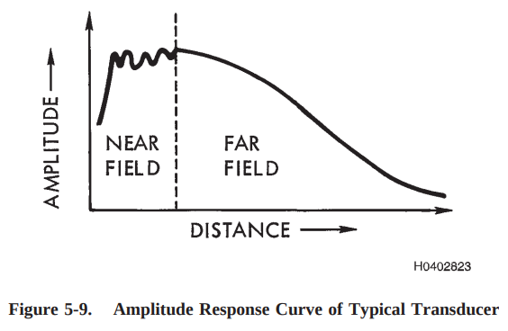

## Beam Spread
Make sure that the signals measured are located in the far-field.

### Near field calculation

Formula used do determine the near-field:

$$
N = \frac{D²}{4 * \lambda}
$$
- N: near-field length
- D: diameter of the transducer
- $\lambda$: Wavelength of sound in the material
- f: frequency
- v: velocity

### Beam half-angle
Shows the angle from the beam's central axis to the -6 dB point of its pressure field.

$$
sin(\theta) = \frac{1.22*\lambda}{D} = \frac{1.22*v}{f*D}
$$
- $\theta$: half-angle of spread
- D: transducer diameter
- $\lambda$: wavelength
- v: velocity

Higher beam angle corresponds with 
- lower ultrasound frequencies
- less ultra-sound decay

# Sources
-  https://content.ndtsupply.com/media/Ultrasonic%20Testing-%20USAF-Tech-Manual-NR2.pdf?utm_source=chatgpt.com
